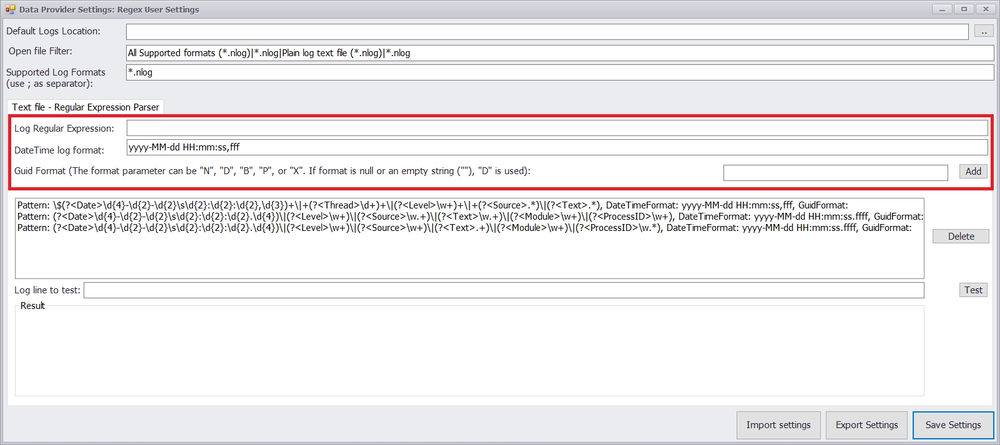
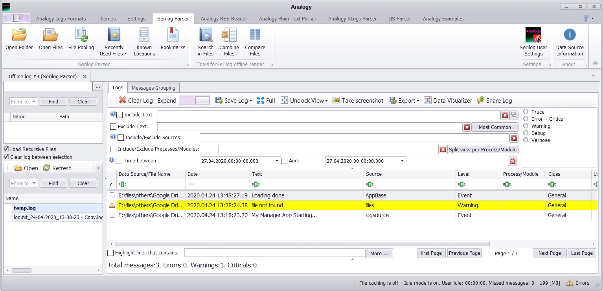

# Analogy.LogViewer.RegexParser          

<p align="center">


 <a href="https://github.com/Analogy-LogViewer/Analogy.LogViewer.RegexParser/issues">
    
</a>

<a href="https://github.com/Analogy-LogViewer/Analogy.LogViewer.RegexParser/blob/master/LICENSE.md">
    
</a>
 [](https://www.nuget.org/packages/Analogy.LogViewer.RegexParser/)
</p>


### Regular Expression Parser for simple text files
In this parser you need to define your custom regex to match you log format in the applcation settings:



with the correct regular expression you can parse you custom format. For example: in the screenshot this example log can be parsed:
```
$2020-04-24 13:18:23,207|1|INFO|logsource|My Manager App Starting...
$2020-04-24 13:28:24,380|1|WARN|files|file not found
$2020-04-24 13:48:27,193|2|INFO|AppBase|Loading done
   ```
 


the available tags to use for parsing are:

   ```csharp
   public enum AnalogyLogMessagePropertyName
   {
       Date,
       Id,
       Text,
       Source,
       MethodName,
       FileName,
       LineNumber,
       Class,
       Level,
       Module,
       MachineName,
       ProcessId,
       ThreadId,
       User,
       RawText,
       RawTextType,
   }
 ```
which corresponding to AnalogyLogMessage fields

 
## Issues
- Windows 10 Blocks Zip files by default. Make sure to [unblocked](https://singularlabs.com/tips/how-to-unblock-a-zip-file-on-windows-10/) before unzipping the files.


## How To Use
1. Download the latest [Analogy Log Viewer](https://github.com/Analogy-LogViewer/Analogy.LogViewer) from the [release](https://github.com/Analogy-LogViewer/Analogy.LogViewer/releases) section (.net framework or .net Core version).
2. Download (or Compile) this project and put the compiled DLL in the same folder as the Analogy Log Viewer.
